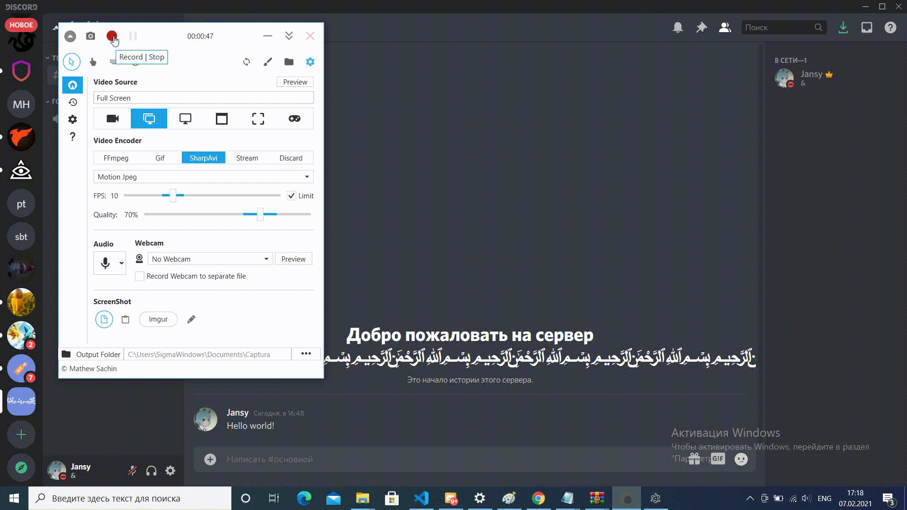

# Edingo RPC
* Easy for use program, the interface is written in electron.
* Ability to save / load settings.
* Ability to add buttons to your profile!

# Usage:
1. Install all required components
    - Download / Clone this repository.
    - [Install node.js if you don't have it.](https://nodejs.org/en/download/)
    - In the folder where you cloned the files, open the console, then write `npm install` for install all required modules.

2. Create Rich Presence application with discord
    - Go to your [applications](https://discordapp.com/developers/applications/me).
    - Make a new application `The name of the app will be the main name for the rich presence`.

# Running:
After installing the modules and creating, run the program by write `npm start` to console.

# Preview

# Fields:
State `(string)` - the 'state' section of the rich game data.
Details `(string)` - the 'details' section of the rich game data.

Time is indicated in unix -> [Time calculator](https://www.unixtimestamp.com/index.php)
Start Time `(Int64)` - the time at which the game started.
End Time `(Int64)` - the time at which the game will end.

You can add assets to your application using this link.

`https://discord.com/developers/applications/`**Your Application ID**`/rich-presence/assets`
Large Image Asset `(string)` - the large image.
Small Image Asset `(string)` - the small image.

Large Image Text `(string)` - the large image tooltip.
Small Image Text `(string)` - the small image tooltip.

Button Label `(string)` - label of the button.
Button Link `(string)` - link of the button.
